### `ahmad@github ~ $ ./contributions.sh`

 

### `ahmad@github ~ $ whoami`

<table>
  <tr>
    <td valign="top"></td>
    <td valign="top"></td>
  </tr>
</table>

 

### `ahmad@github ~ $ open links`

[Portfolio](https://ahmadkh.framer.ai/) · [LinkedIn](https://www.linkedin.com/in/ahmad-khalil05/) · [Behance](https://www.behance.net/AhmadKhalil0)

